# @avatune/fatin-verse-assets

Fatin Verse style SVG assets for avatar generation.

## Description

This package provides SVG assets in fatin verse style for creating customizable avatars. Assets include various options for hair, eyes, eyebrows, mouth, nose, ears, head shape, and body/clothing.

## Installation

```bash
npm install @avatune/fatin-verse-assets
```

## Usage

### SVG Paths

```typescript
import { hair, eyes, mouth } from '@avatune/fatin-verse-assets';
```

### React Components

```typescript
import { HairShort, EyesBoring, MouthSmile } from '@avatune/fatin-verse-assets/react';
```

### React Native Components

```typescript
import { HairShort, EyesBoring, MouthSmile } from '@avatune/fatin-verse-assets/react-native';
```

### Svelte Components

```typescript
import { HairShort, EyesBoring, MouthSmile } from '@avatune/fatin-verse-assets/svelte';
```

### Vue Components

```typescript
import { HairShort, EyesBoring, MouthSmile } from '@avatune/fatin-verse-assets/vue';
```

## Available Assets

### Accessories

| Preview | Filename |
|---------|----------|
| 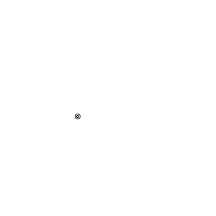 | `beauty-mark` |
| 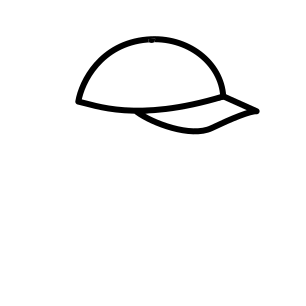 | `cap` |
| 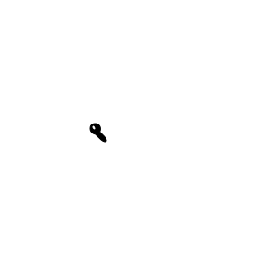 | `earpiece-left` |
|  | `earring-right` |
|  | `glasses-round` |
|  | `glasses-square` |
|  | `headset-mic` |
| 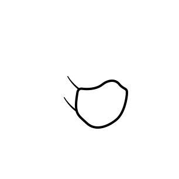 | `mask` |
| 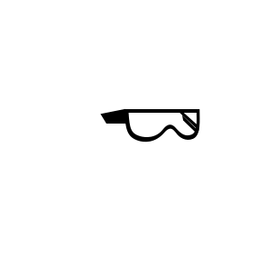 | `visor-glasses` |

### Body

| Preview | Filename |
|---------|----------|
| 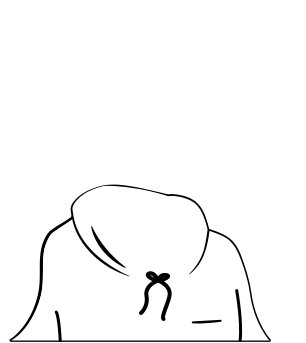 | `hoodie` |
| 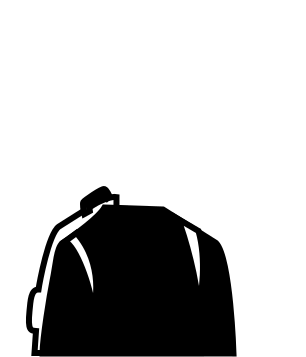 | `jacket` |
| 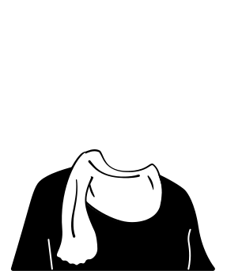 | `scarf-top` |
| 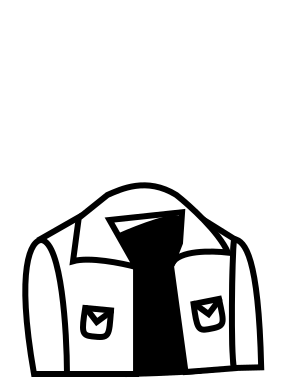 | `shirt-tie` |
| 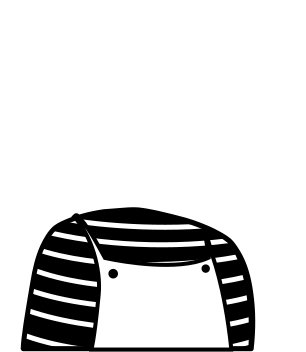 | `striped-overall` |
| 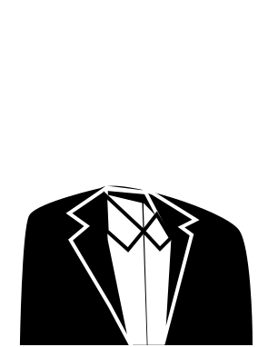 | `suit` |
|  | `turtleneck` |

### Eyebrows

| Preview | Filename |
|---------|----------|
|  | `brow-angled` |
|  | `brow-flat` |
|  | `brow-raised` |
|  | `brow-soft` |
|  | `brow-thick` |
|  | `brow-thin` |

### Eyes

| Preview | Filename |
|---------|----------|
|  | `eyes-focused` |
|  | `eyes-happy` |
| 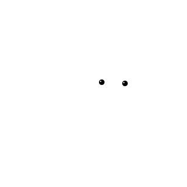 | `eyes-neutral` |
|  | `eyes-surprised` |
|  | `eyes-wide` |

### FaceHair

| Preview | Filename |
|---------|----------|
|  | `beard` |
|  | `mustache` |

### Hair

| Preview | Filename |
|---------|----------|
|  | `curly-puff` |
|  | `curly-top` |
|  | `curved-long` |
|  | `double-buns` |
|  | `long-braid` |
|  | `long-straight` |
|  | `long-wave` |
|  | `low-bun` |
|  | `short-curly` |
|  | `short-flip` |
|  | `short-messy` |
|  | `short-wave` |
|  | `side-ponytail` |
|  | `side-sweep` |
|  | `spiky` |
|  | `tight-curls` |
|  | `volumized` |

### Head

| Preview | Filename |
|---------|----------|
| 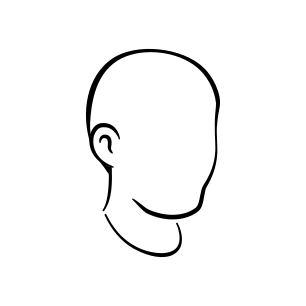 | `diamond` |
| 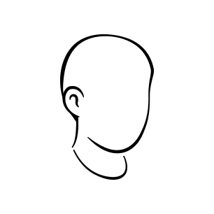 | `heart` |
| 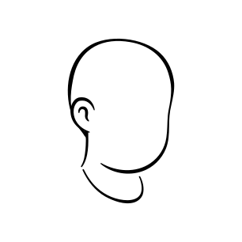 | `oval` |
| 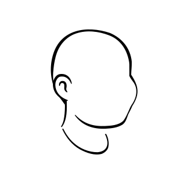 | `pear` |
| 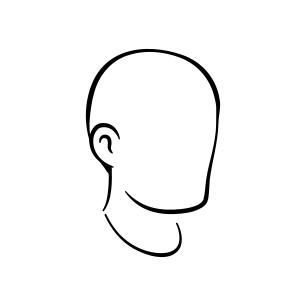 | `round` |
| 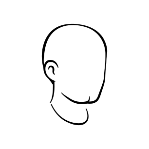 | `square` |
| 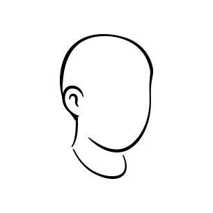 | `thin` |
|  | `triangle` |
| 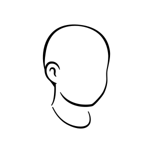 | `wide` |

### Mouth

| Preview | Filename |
|---------|----------|
|  | `neutral-line` |
|  | `smile-small` |
|  | `smile-soft` |
|  | `smirk-left` |
| 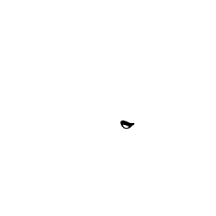 | `smirk-right` |
|  | `tiny-dot` |

### Noses

| Preview | Filename |
|---------|----------|
|  | `nose-curve` |
|  | `nose-long` |
|  | `nose-pointy` |
|  | `nose-round` |
|  | `nose-small` |
|  | `nose-soft` |

## Development

Build the library:

```bash
bun run build
```

Build per-platform in watch mode:

```bash
# Web targets (React/Vue/Svelte/SVG)
bun run dev:web

# React Native components
bun run dev:native
```
