# @avatune/kyute-assets

Kyute style SVG assets for avatar generation.

## Description

This package provides SVG assets in kyute style for creating customizable avatars. Assets include various options for hair, eyes, eyebrows, mouth, nose, ears, head shape, and body/clothing.

## Installation

```bash
npm install @avatune/kyute-assets
```

## Usage

### SVG Paths

```typescript
import { hair, eyes, mouth } from '@avatune/kyute-assets';
```

### React Components

```typescript
import { HairShort, EyesBoring, MouthSmile } from '@avatune/kyute-assets/react';
```

### Svelte Components

```typescript
import { HairShort, EyesBoring, MouthSmile } from '@avatune/kyute-assets/svelte';
```

### Vue Components

```typescript
import { HairShort, EyesBoring, MouthSmile } from '@avatune/kyute-assets/vue';
```

## Available Assets

### Body

| Preview | Filename |
|---------|----------|
| 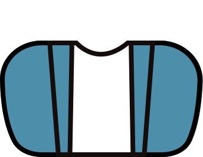 | `casual` |
| 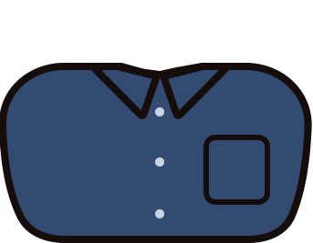 | `shirt` |
|  | `tshirt` |
| 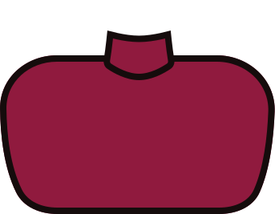 | `turtleneck` |

### Ears

| Preview | Filename |
|---------|----------|
|  | `standard` |

### Eyebrows

| Preview | Filename |
|---------|----------|
|  | `thick1` |
|  | `thick2` |
| 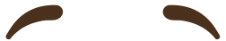 | `thickSad` |
|  | `thin` |
|  | `thinCurly` |
|  | `thinWide` |

### Eyes

| Preview | Filename |
|---------|----------|
|  | `big` |
|  | `huge` |
|  | `medium` |
|  | `oval` |
|  | `standard` |

### FaceDetails

| Preview | Filename |
|---------|----------|
|  | `blushes` |
|  | `freckles` |

### FaceHair

| Preview | Filename |
|---------|----------|
| 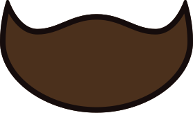 | `beard` |
| 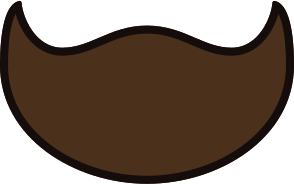 | `bigBeard` |
|  | `mustache` |

### Glasses

| Preview | Filename |
|---------|----------|
|  | `aviator` |
|  | `harry` |
|  | `round` |
|  | `standard` |

### Hair

| Preview | Filename |
|---------|----------|
|  | `bob` |
| 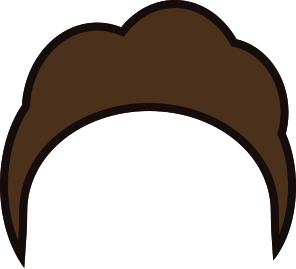 | `curly` |
|  | `curlyMedium` |
| 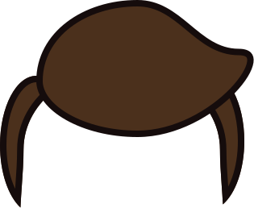 | `elvis` |
| 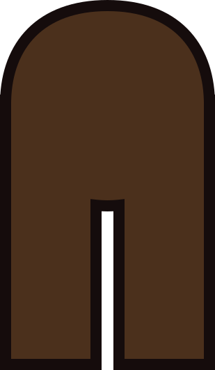 | `long` |
| 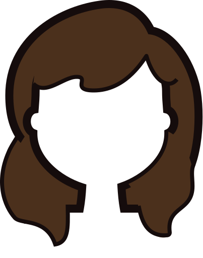 | `longThick` |
|  | `longWavy` |
| 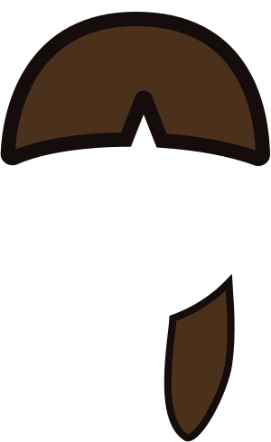 | `ponyTail` |
| 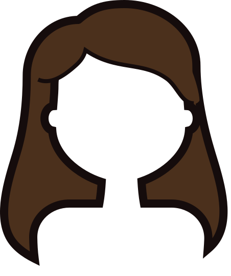 | `rapunzel` |
| 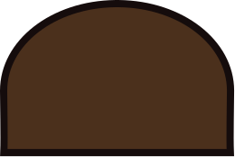 | `short` |
| 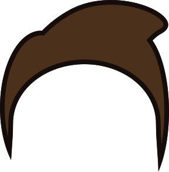 | `stylish` |
|  | `thick` |
|  | `topKnot` |

### Head

| Preview | Filename |
|---------|----------|
| 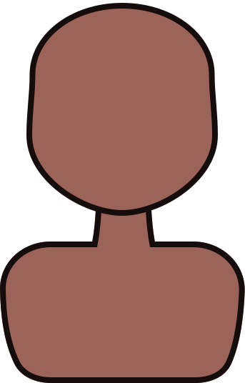 | `standard` |

### Mouth

| Preview | Filename |
|---------|----------|
|  | `lips1` |
|  | `lips2` |
|  | `lipsSmile` |
| 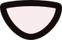 | `open` |
|  | `openDimples` |
|  | `smile1` |
|  | `smile2` |
|  | `smileOpen` |
|  | `smirk` |
| 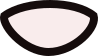 | `wideOpen` |

## License & Credits

See [LICENSE.md](LICENSE.md) for license information.

See [CREDITS.md](CREDITS.md) for attribution and credits.

## Development

Build the library:

```bash
bun run build
```

Build in watch mode:

```bash
bun dev
```
