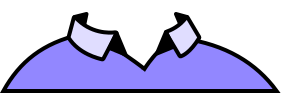
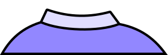
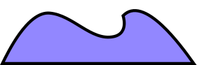
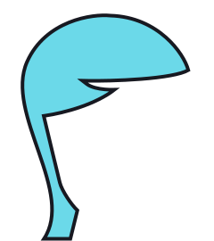
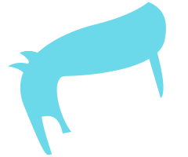
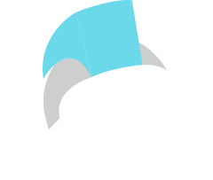
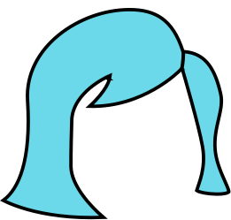
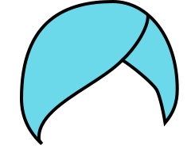
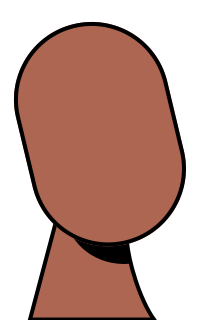
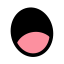

# @avatune/micah-assets

Micah style SVG assets for avatar generation.

## Description

This package provides SVG assets in Micah style for creating customizable avatars. Assets include various options for hair, eyes, eyebrows, mouth, nose, ears, head shape, and body/clothing.

## Installation

```bash
npm install @avatune/micah-assets
```

## Usage

### SVG Paths

```typescript
import { hair, eyes, mouth } from '@avatune/micah-assets';
```

### React Components

```typescript
import { HairShort, EyesBoring, MouthSmile } from '@avatune/micah-assets/react';
```

### Svelte Components

```typescript
import { HairShort, EyesBoring, MouthSmile } from '@avatune/micah-assets/svelte';
```

### Vue Components

```typescript
import { HairShort, EyesBoring, MouthSmile } from '@avatune/micah-assets/vue';
```

## Available Assets

### Accessories

| Preview | Filename |
|---------|----------|
|  | `hoop-ear-ring` |
|  | `stud-ear-ring` |

### Body

| Preview | Filename |
|---------|----------|
|  | `collared-shirt` |
|  | `crew-shirt` |
|  | `open-shirt` |

### Ears

| Preview | Filename |
|---------|----------|
|  | `medium` |
|  | `small` |

### Eyebrows

| Preview | Filename |
|---------|----------|
|  | `down` |
|  | `eyelashes-down` |
|  | `eyelashes-up` |
|  | `up` |

### Eyes

| Preview | Filename |
|---------|----------|
|  | `eyeshadow` |
|  | `round` |
|  | `smiling` |
|  | `standard` |

### Face-hair

| Preview | Filename |
|---------|----------|
|  | `beard` |
|  | `scruff` |

### Glasses

| Preview | Filename |
|---------|----------|
|  | `round` |
|  | `square` |

### Hair

| Preview | Filename |
|---------|----------|
|  | `danny-phantom` |
|  | `doug-funny` |
|  | `fonze` |
|  | `full` |
|  | `mr-t` |
|  | `pixie` |
|  | `turban` |

### Head

| Preview | Filename |
|---------|----------|
|  | `standard` |

### Mouth

| Preview | Filename |
|---------|----------|
|  | `frown` |
|  | `laughing` |
|  | `nervous` |
|  | `pucker` |
|  | `sad` |
|  | `smile` |
|  | `smirk` |
|  | `surprised` |

### Noses

| Preview | Filename |
|---------|----------|
|  | `curve` |
|  | `pointed` |
|  | `round` |

## License & Credits

See [LICENSE.md](LICENSE.md) for license information.

See [CREDITS.md](CREDITS.md) for attribution and credits.

## Development

Build the library:

```bash
bun run build
```

Build in watch mode:

```bash
bun dev
```
