# @avatune/yanliu-assets

Yanliu style SVG assets for avatar generation.

## Description

This package provides SVG assets in Yanliu style for creating customizable avatars. Assets include various options for hair, eyes, eyebrows, mouth, nose, ears, head shape, and body/clothing.

## Installation

```bash
npm install @avatune/yanliu-assets
```

## Usage

### SVG Paths

```typescript
import { hair, eyes, mouth } from '@avatune/yanliu-assets';
```

### React Components

```typescript
import { HairShort, EyesBoring, MouthSmile } from '@avatune/yanliu-assets/react';
```

### Svelte Components

```typescript
import { HairShort, EyesBoring, MouthSmile } from '@avatune/yanliu-assets/svelte';
```

### Vue Components

```typescript
import { HairShort, EyesBoring, MouthSmile } from '@avatune/yanliu-assets/vue';
```

## Available Assets

### Body

| Preview | Filename |
|---------|----------|
|  | `blouse` |
| 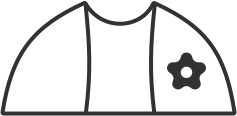 | `flowerCardigan` |
| 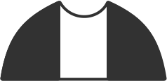 | `simpleCardigan` |
| 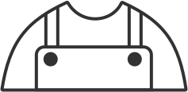 | `simpleOverall` |
| 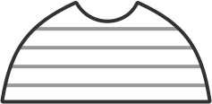 | `striped` |
| 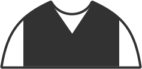 | `sweaterVest` |
|  | `sweaterWavy` |
| 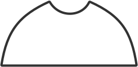 | `teeBasic` |
|  | `teeButtoned` |
| 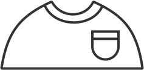 | `teePocket` |
| 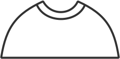 | `teeRound` |

### Ears

| Preview | Filename |
|---------|----------|
|  | `standard` |

### Eyes

| Preview | Filename |
|---------|----------|
|  | `standard` |

### FaceDetails

| Preview | Filename |
|---------|----------|
|  | `blushes` |

### FaceHair

| Preview | Filename |
|---------|----------|
|  | `bigBeard` |
|  | `chevronMustache` |
|  | `mustache` |

### Forelock

| Preview | Filename |
|---------|----------|
|  | `bubble` |
|  | `curve` |
| 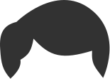 | `short` |
|  | `split` |
|  | `straight` |
|  | `underCut` |

### Glasses

| Preview | Filename |
|---------|----------|
|  | `glass` |

### Hair

| Preview | Filename |
|---------|----------|
| 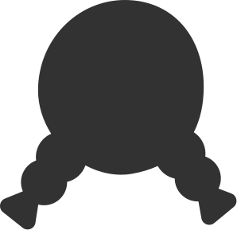 | `braids` |
| 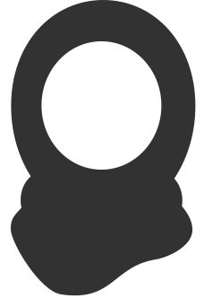 | `hijab` |
|  | `medium` |
|  | `puff` |
|  | `straightLong` |
|  | `straightMedium` |

### Hats

| Preview | Filename |
|---------|----------|
|  | `beanie` |
|  | `hat` |

### Head

| Preview | Filename |
|---------|----------|
| 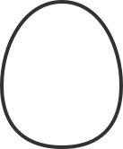 | `standard` |

### Mouth

| Preview | Filename |
|---------|----------|
|  | `smile` |

### Neck

| Preview | Filename |
|---------|----------|
|  | `standard` |

### Noses

| Preview | Filename |
|---------|----------|
|  | `standard` |

## License & Credits

See [LICENSE.md](LICENSE.md) for license information.

See [CREDITS.md](CREDITS.md) for attribution and credits.

## Development

Build the library:

```bash
bun run build
```

Build in watch mode:

```bash
bun dev
```
