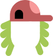

# @avatune/flat-design-assets

Flat Design style SVG assets for avatar generation.

## Description

This package provides SVG assets in flat design style for creating customizable avatars. Assets include various options for hair, eyes, eyebrows, mouth, nose, ears, head shape, and body/clothing.

## Installation

```bash
npm install @avatune/flat-design-assets
```

## Usage

### SVG Paths

```typescript
import { hair, eyes, mouth } from '@avatune/flat-design-assets';
```

### React Components

```typescript
import { HairShort, EyesBoring, MouthSmile } from '@avatune/flat-design-assets/react';
```

### Svelte Components

```typescript
import { HairShort, EyesBoring, MouthSmile } from '@avatune/flat-design-assets/svelte';
```

### Vue Components

```typescript
import { HairShort, EyesBoring, MouthSmile } from '@avatune/flat-design-assets/vue';
```

## Available Assets

### Body

| Preview | Filename |
|---------|----------|
|  | `shirt` |
|  | `sweater` |
|  | `tshirt` |
|  | `turtleneck` |

### Ears

| Preview | Filename |
|---------|----------|
|  | `standard` |

### Eyebrows

| Preview | Filename |
|---------|----------|
|  | `angry` |
|  | `small` |
|  | `standard` |

### Eyes

| Preview | Filename |
|---------|----------|
|  | `boring` |
|  | `dots` |
|  | `openCircle` |
|  | `openRounded` |

### Hair

| Preview | Filename |
|---------|----------|
|  | `bobRounded` |
|  | `bobStraight` |
|  | `cupCurly` |
|  | `long` |
|  | `medium` |
|  | `short` |

### Head

| Preview | Filename |
|---------|----------|
|  | `oval` |

### Mouth

| Preview | Filename |
|---------|----------|
|  | `bigSmile` |
|  | `flat` |
|  | `frown` |
|  | `halfOpen` |
|  | `laugh` |
|  | `nervous` |
|  | `smile` |

### Noses

| Preview | Filename |
|---------|----------|
|  | `big` |
|  | `curve` |
|  | `dots` |
|  | `halfOval` |

## License & Credits

See [LICENSE.md](LICENSE.md) for license information.

## Development

Build the library:

```bash
bun run build
```

Build in watch mode:

```bash
bun dev
```
